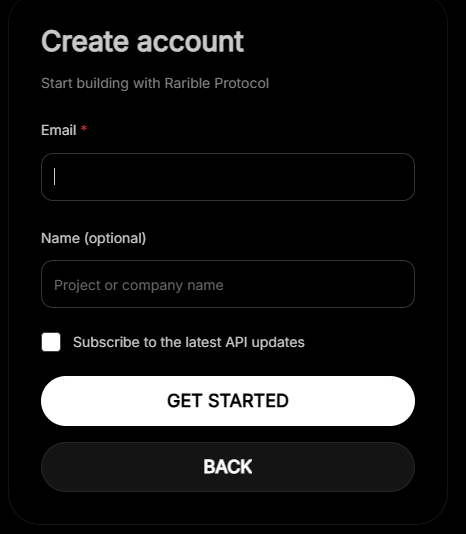
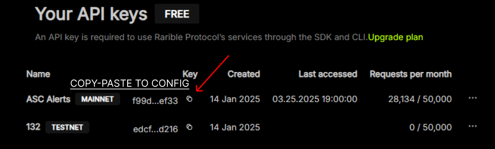
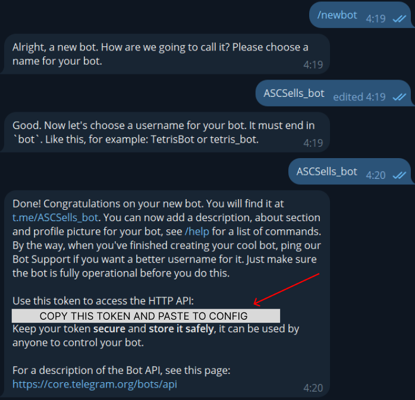

# Alert Bot

This bot provides notifications for a ASC collection on Rarible.

# Dependences:
API KEY
1. https://api.rarible.org/dashboard/api-keys - visit the link
2. Click on Login & complete registration 
3. Create MAINNET API KEY - Copy it & Paste to config.py

Bot Token
1. Head to @BotFather in telegram
2. Hit Start and type /newbot
3. Name the bot and copy his token and paste to config.py 
4. Head to your created bot and hit /start

## Installation

1. Install Python 3.8+
2. Clone this repository
3. Install dependencies:
pip install -r requirements.txt
4. Configure `config.py` with your details (API-KEY, BOT TOKEN)

## Running the Bot

Start the bot with: python main.py

